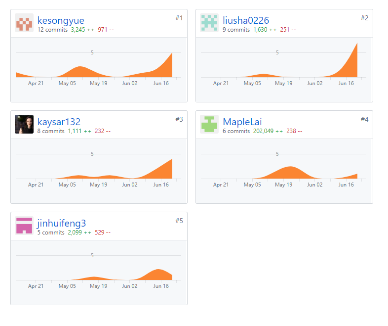

# 小组分工说明

+ 小组分工与贡献率

| 学号     | 姓名          | 分工                                                         | 贡献率 |
| -------- | ------------- | ------------------------------------------------------------ | ------ |
| 16340101 | 柯松岳(组长)  | 项目管理、需求分析、Tabbar布局、“我的活动”页面、“任务详情”页面、小组分工文档、软件需求规格说明文档 | 20%    |
| 16340099 | 开塞尔·艾则孜 | 需求分析、”任务发布“页面、 “注册登录”页面、软件需求规格说明文档 | 20%    |
| 16340100 | 康一博        | 架构设计、“找活动”页面、“任务详情”页面、“发问卷”页面、安装部署说明文档、用户手册 | 20%    |
| 16340102 | 赖成枫        | 架构设计、服务器与数据库搭建，软件设计文档                   | 20%    |
| 16340097 | 金汇丰        | UI设计、交互设计、软件设计文档、数据库设计、“我”页面、注册登录UI完善 | 20%    |

+ 制品与贡献率

|      | 制品                           | 柯松岳 | 开塞尔·艾则孜 | 康一博 | 赖成枫 | 金汇丰 |
| ---- | ------------------------------ | ------ | ------------- | ------ | ------ | ------ |
| 源码 | 注册登录界面                   | -      | 90%           | -      | -      | 10%    |
| 源码 | “找活动”界面                   | -      | -             | 100%   | -      | -      |
| 源码 | “发布活动“界面                 | -      | 100%          | -      | -      | -      |
| 源码 | ”我的活动“页面                 | 100%   | -             | -      | -      | -      |
| 源码 | ”我“页面                       | -      | -             | -      | -      | 100%   |
| 源码 | 问卷调查功能                   | 40%    | 10%           | 40%    | 10%    | -      |
| 源码 | “任务详情”页面                 | 50%    | -             | 50%    | -      | -      |
| 源码 | 后台API和数据库                | -      | -             | -      | 95%    | 5%     |
| 文档 | 《安装部署说明》和《用户手册》 | -      | -             | 100%   | -      | -      |
| 文档 | 《软件设计文档》               | -      | -             | -      | 50%    | 50%    |
| 文档 | 《软件需求规格说明书》         | 30%    | 70%           | -      | -      | -      |
| 文档 | 《小组分工与贡献率说明》       | 100%   | -             | -      | -      | -      |

+ 组员贡献分布图：

  