## UI设计
<hr>

### 总述
挣闲钱通过微信小程序平台实现，因此在UI设计主要采用了微信的原生风格，界面布局多使用微信原生组件实现。
<br><br>
根据我们的业务逻辑，前端的UI可以主要分为五个部分：

* 登录/注册
* 找任务
* 发布任务
* 我的任务（进行任务管理）
* 我（修改个人信息、充值闲钱币）

除登录注册以外，其他的四个部分通过小程序的tabbar将业务逻辑隔开
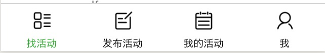

### 设计理念和优势
1）整洁简约：整个小程序的风格完全融入了微信的环境，采用原生组件的搭配可以让用户更有亲切感。同时设计整体没有冗余的部分，简单实用，又不乏一种纯粹的美感。<br><br>
2）效率高：没有多余的修饰可以让用户快速找到自己需要的功能；同时，UI的设计很多源于对微信本身的模仿，让已经熟悉微信操作的用户对本软件可以快速上手。<br><br>
3）交互感强：对于用户的操作提供了及时的确认成功信息反馈，如果用户操作不当也会有及时的提示信息，整体上较好地引导用户操作。<br><br>
4）突出重点：整个UI的设计都以实用性为主，用户在每个界面都可以快速抓住重点，完成所需要的业务流程。


### 界面样例


登录/注册相关界面

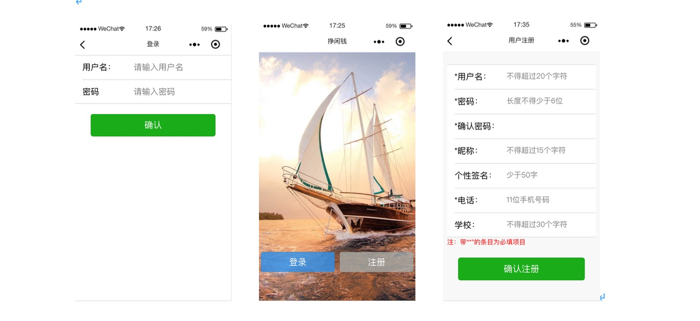

个人信息/充值相关界面
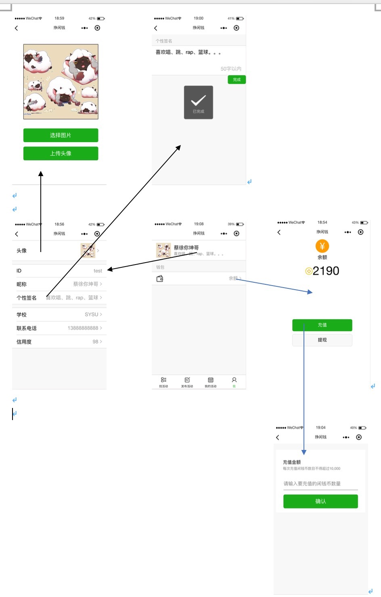

## 模块划分
<hr>

### 登录/注册
用户刚进入小程序中可以选择登录或者注册，并跳转到对应的界面进行操作。（界面可参考UI设计部分）
<br>
登录通过用户名和密码进入用户。
<br>
如果是新用户，需要填写一下信息完成注册：
* 用户名（20字符内，必填）
* 密码（6位以上，必填）
* 确认密码（必填）
* 昵称（15字符内，必填）
* 个性签名（少于50字）
* 电话（11位手机号，必填）
* 学校（30字符内）

### 参加活动

用户登录成功后进入的第一个页面就是找活动的界面，在这个界面中，可以通过分类找到自己感兴趣的活动，获取相应的信息（发布者、任务详情），确认无误后可以参加相应的活动。
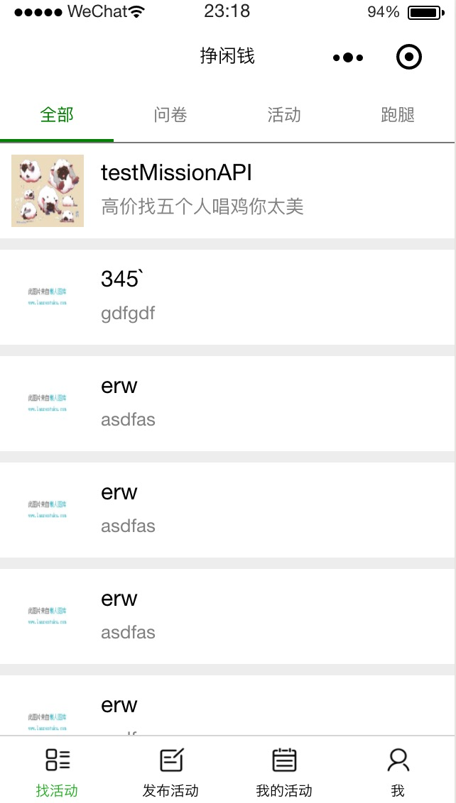

### 发布任务

每个用户不但可以参加任务，也有权利发布任务。<br>
任务的类型主要包括三种：
* 问卷（会有单独介绍）
* 活动
* 跑腿（可以是拿外卖之类的）

如果是发布问卷的话，发布时候会跳转到相应的编辑题目页面，每个任务包括以下属性：
* 标题
* 报酬
* 参加人数
* 类别
* 详情
* 描述图片

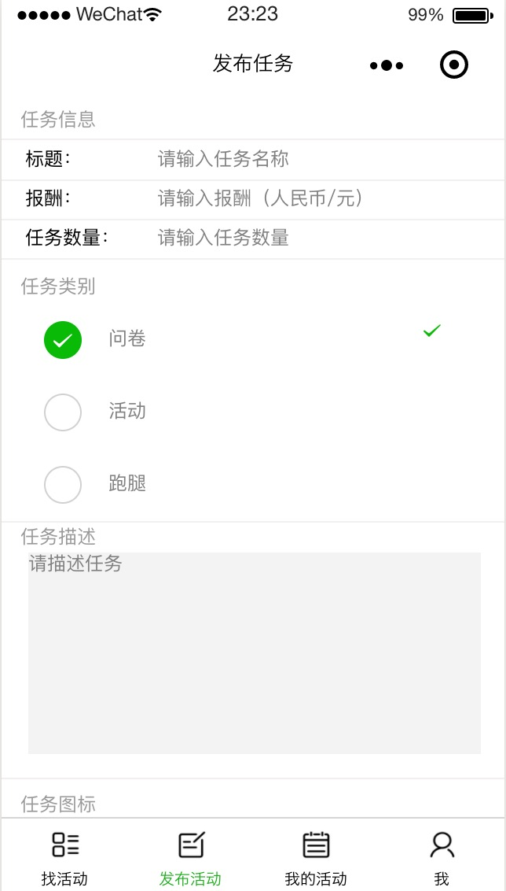
### 管理任务
挣现钱的业务逻辑是：每个人都可以发布任务（问卷、参加活动、跑腿），每个人也可以参加任务。<br>
因此，就需要有特定的模块对与用户本身相关的任务进行处理。我的活动部分分为我参加的和我发布的，同时用户对于这两种情况都可以查看当前进行中的或者历史记录（已结束）。参与者如果需要取消参加、发布者如果需要取消发布和确认活动完成状态也是在这部分完成任务。
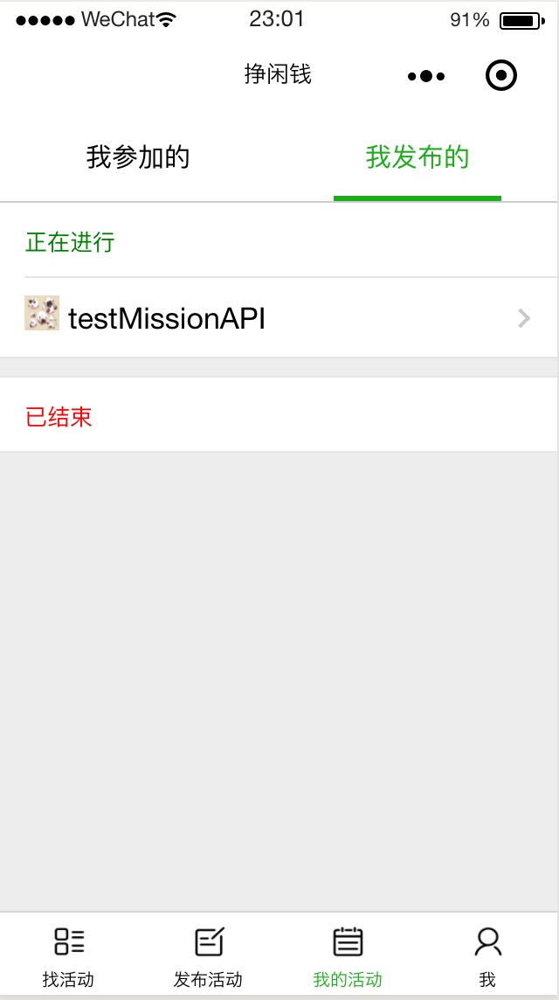
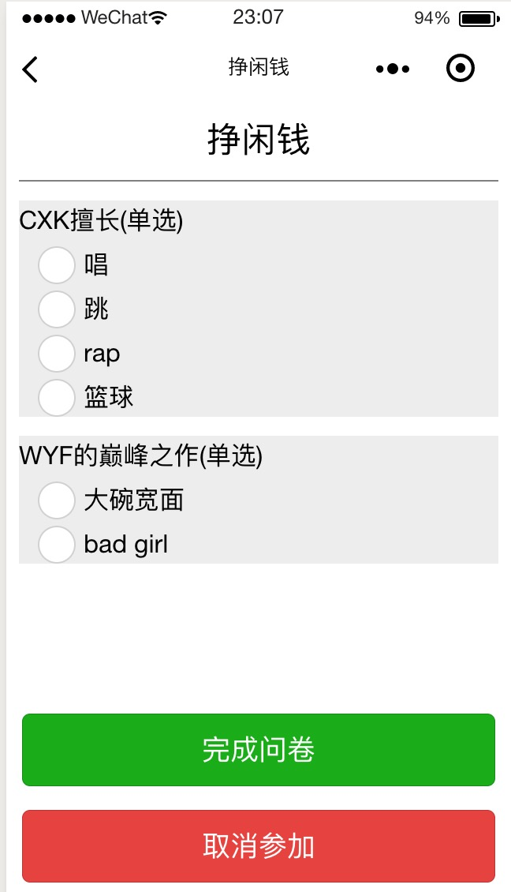
### 个人信息修改
用户可以在"我"的部分修改个人信息，可以修改的内容包括：
* 昵称（15字以内）
* 个性签名（50字内）
* 学校（30个字符内）
* 电话（11位有效数字）
* 头像

具体的修改流程和效果可以参照UI设计的样例展示，如果用户的修改内容不符合要求将会出现对应的提示，如果修改成功将会出现“已完成”的成功提示。

### 闲钱币系统
闲钱币是在挣闲钱小程序中的一种虚拟代币，用户在发布有偿的活动时就是通过闲钱币进行奖励，参加者在参与成功时将会以闲钱币的方式获得奖励。<br>
用户发布任务时将会扣除对应设置的闲钱币，确认任务结束状态时，对应的闲钱币将会发到对应参与的用户账户里。每个人可以充值闲钱币，也可以提现，由于小程序本身对于微信支付API的限制，这里只能模拟一个充值提现的过程。具体UI和流程可以参照UI设计部分的图片展示。

### 信用评级
信用评级用于让用户判别合作伙伴是否可靠。在个人信息部分给出了相应的说明让用户了解信用机制。
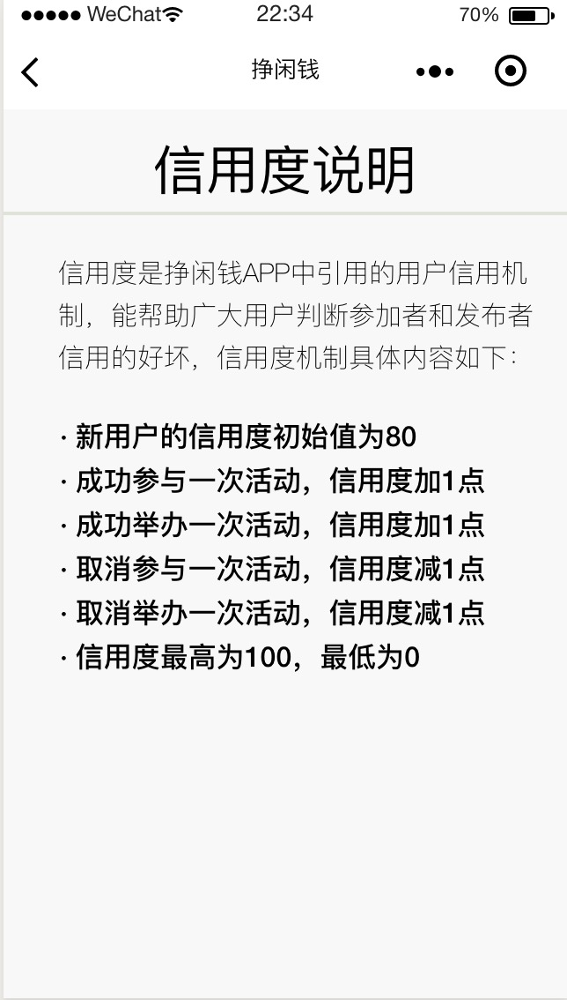

每个人可以在任务详情中通过点击发布者/参加者的头像获得该用户的信息，查看信用度。

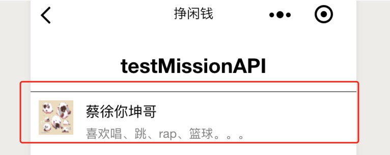
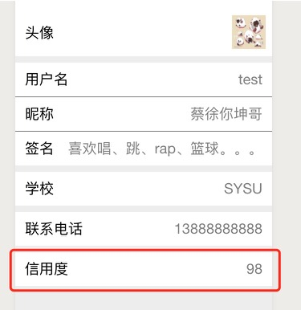

### 问卷系统
由于项目本身要求，这里单独特别实现了问卷系统。需要发布问卷的人在发布任务的时候要设置相关题目，参加任务的人在“我的活动->我参加的”的部分完成填写问卷。


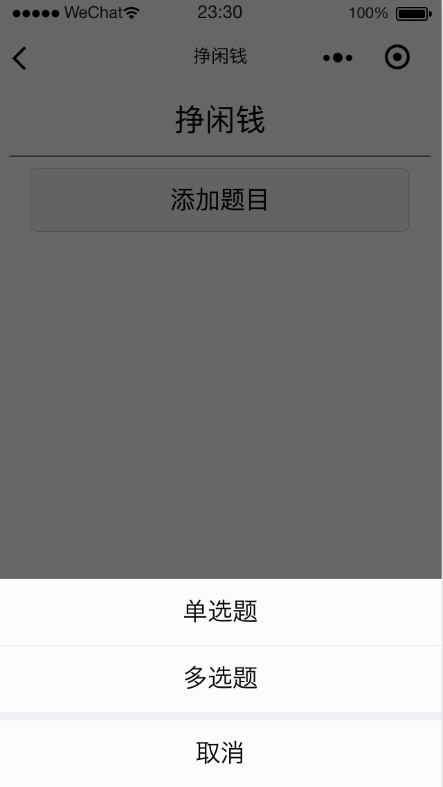
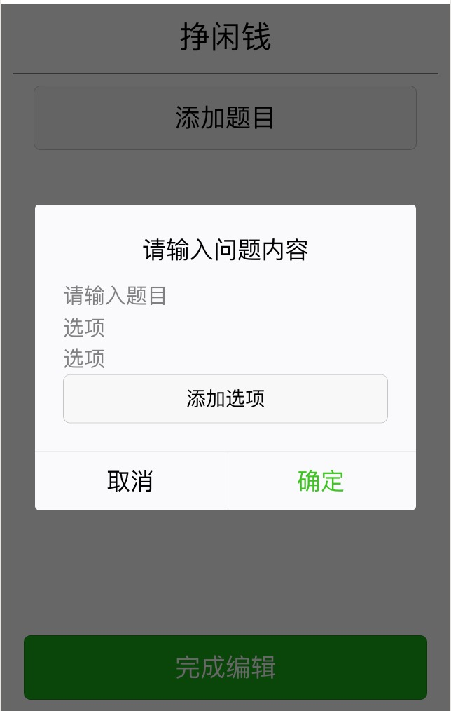


#### 架构设计

##### 技术选择理由

服务端开发选择了Node.js+express+MySQL这种网站服务器架构

- Node.js：Node.js是一个开源和跨平台的JavaScript运行时环境，专为构建可扩展的服务器端WEB应用而设计，拥有事件驱动，异步编程，非阻塞式IO等运行逻辑。此外，Node.js还具有高并发、扩展性强等特点，目前它已经成为世界上最大的开源项目。
- express：Express是一个很小的Web应用程序框架，但却非常灵活，为Web和移动应用程序开发提供了一组强大的功能，它利用各种中间件帮助管理服务器和路由。鉴于“挣闲钱”这种服务平台的特点，使用与“业务+服务”非常契合的express框架是非常方便的。
- MySQL：SQL是一门ANSI的标准计算机语言，用来访问和操作数据库系统。SQL语句用于取回和更新数据库中的数据。SQL可与数据库程序协同工作，比如MS Access、DB2、Informix、MS SQL Serve、Oracle、Sybase以及其他数据库系统。 在以前的数据库原理课程中，老师是以MySQL为核心进行教学的，因此我对此相对比较熟悉，故MySQL是我的不二之选。

##### 服务端代码目录


##### 逻辑架构

逻辑架构由四层模型（表示层、业务层、服务层、持久化层）构成

- 表示层：学生使用微信小程序作为表示层，提供用户管理系统、闲钱币管理系统、任务管理系统、信用度管理系统。
- 业务层：服务器充当业务层的角色，根据用户的操作调用对应的服务层模块，提供服务。

- 服务层：利用业务层提供的数据构建数据模型，对存储库进行创建模型、删除模型、更新模型和检索模型等操作。
- 持久化层：使用MySQL 使数据持久化。

##### 模块设计

服务端的模块划分大致由三部分组成：

- 个人信息模块（学生进行登录/注册用户，查看或者修改个人信息）
- 发布者请求模块
  - 发布任务模块（提供一个新任务所需的所有完整信息，将新任务添加进数据库）
  - 查看任务进度模块（在个人页面查看已发布任务的进度情况）
  - 取消已发布任务模块（取消已经发布的任务，涉及到对闲钱币和信用度的更新）

- 接受者请求模块
  - 拉取任务模块（获取所有未完成任务的信息）
  - 接受任务模块（在任务详情页面接受任务，更新数据库防止重复接受、多人接受的情况）
  - 提交任务模块（提交任务证明，服务端自动处理，更新发布者和接受者闲钱币和信用度的状态）
  - 取消已接受任务模块（取消已经接受的任务，涉及到对闲钱币和信用度的更新）

##### 数据库设计


- users

```sql
CREATE TABLE users (uid VARCHAR(20) PRIMARY KEY NOT NULL,
									   passwd VARCHAR(20),
									   nickname VARCHAR(20),
									   signature VARCHAR(100),
                                       img_url VARCHAR(100),
                                       tel VARCHAR(20),
                                       school VARCHAR(50),
                                       money MEDIUMINT,
                                       credit TINYINT);

```


- missions

```sql
CREATE TABLE missions(mid INT PRIMARY KEY NOT NULL,
										   title VARCHAR(50),
                                           uid VARCHAR(20) NOT NULL,
                                           reward MEDIUMINT, 
                                           mtype VARCHAR(20),
                                           description VARCHAR(500), 
                                           imgs_url VARCHAR(500) ,
                                           people_limit MEDIUMINT,
                                           people MEDIUMINT,
                      					   submit MEDIUMINT,
                                           ing BOOLEAN,
                                           FOREIGN KEY(uid) REFERENCES users(uid));

```


- operations

```sql
CREATE TABLE operations(oid INT AUTO_INCREMENT PRIMARY KEY NOT NULL,
											  uid VARCHAR(20) NOT NULL,
                                              mid INT NOT NULL,														              missions(mid)),
                                              finish BOOLEAN,
                                              FOREIGN KEY(uid) REFERENCES users(uid),
                                              FOREIGN KEY(mid) REFERENCES  ;
```


- questions

```sql
CREATE TABLE questions(qid INT AUTO_INCREMENT PRIMARY KEY NOT NULL,
                                              mid INT NOT NULL,														              type VARCHAR(20) NOT NULL,
                                              question VARCHAR(20) NOT NULL,
                                              no INT NOT NULL;
```


- options

```sql
CREATE TABLE optionss(opid INT AUTO_INCREMENT PRIMARY KEY NOT NULL,
                                              qid INT NOT NULL,														              opt VARCHAR(20) NOT NULL,
                                              FOREIGN KEY(qid) REFERENCES questions(qid);
```